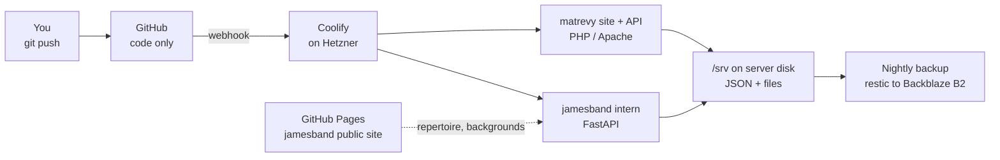
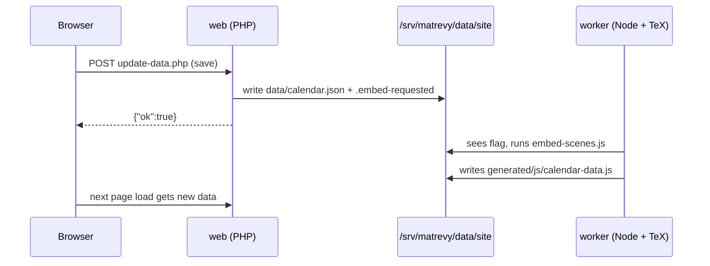

# Hosting walkthrough: jamesband & matrevy on one server

Sep 23, 2026 · @Someone

## Overview

Both projects move onto one Hetzner server in Germany, managed with Coolify, and their data moves out of GitHub onto that server's disk. Expect about €7 a month in total and three or four weekends of work, done in small steps that each leave everything working.



GitHub keeps your code and triggers deploys. The server runs the apps and holds the data. Simply.com keeps your domains and DNS.

### What changes

| Project | Today | After |
| --- | --- | --- |
| jamesband intern | Render free, clones the repo at startup, `git push` on every save | Always-on container, saves are plain file writes on the server |
| jamesband public | GitHub Pages, updated by commits from the intern app | Still GitHub Pages; repertoire and backgrounds load live from the intern app |
| matrevy API | PHP on Simply.com, manual upload, writes JSON to GitHub via the Contents API | PHP container, deploys on push, writes JSON to the server disk |
| matrevy site | GitHub Pages, data rebuilt by Actions in 1–2 minutes | Served by the same container; saved data is visible on the next page load |
| Private data (budget, forms, fællesspisning) | Simply.com disk, no off-host backup | Server disk, backed up nightly off-site |

### A change from my earlier advice

After reading the code, I'd skip Postgres for now. Both apps already store small JSON documents, so keeping them as files on the server removes the git bottleneck with far less rewriting. Coolify can add Postgres in one click when you start the multi-tenant version of matrevy.

### Monthly cost

| Item | Price (excl. VAT) |
| --- | --- |
| Hetzner CX23 server (2 vCPU, 4 GB RAM, 40 GB disk) | €5.49 |
| Public IPv4 address | €0.50 |
| Hetzner automatic backups (20% of server price) | \~€1.10 |
| Off-site backup on Backblaze B2 (a few hundred MB) | cents |
| **Total** | **\~€7.10** |

Prices from [CostGoat's Hetzner calculator](https://costgoat.com/pricing/hetzner), updated 5 Sep 2026. Hetzner raised prices on 15 June 2026, so check the live price when you order.

### Order of work

| Part | What you do | Time | Result |
| --- | --- | --- | --- |
| 0–2 | Accounts, server, Coolify | 2–3 hours | An empty, secured server with a dashboard |
| 3 | Backups | 1 hour | Nightly off-site copies of `/srv` |
| 4 | jamesband intern, unchanged | 1 hour | No more cold starts |
| 5 | jamesband data off git | 1 evening | Fast saves, private data out of the public repo |
| 6 | matrevy API to the server | 1–2 evenings | No manual uploads, private data backed up |
| 7 | matrevy data off git | 1–2 weekends | No 1–2 minute delay, no Actions pipeline |

Parts 5 and 7 are code changes. They're good tasks to hand to Claude Code with this doc as the spec.

## Part 0: Prerequisites

Gather accounts, keys and current secrets before you touch anything, so the moves later are quick. Keep every secret in a password manager, never in a repo.

Placeholders used in this doc: `<server-ip>` is your new server's IPv4 address, and `<band-domain>` is the band's domain (the one whose `intern.` subdomain points at Render today).

### Accounts

- [x] **Hetzner Cloud** at console.hetzner.cloud. New accounts may need ID verification, which can take a day.
- [x] **Backblaze B2** for off-site backups (Part 3).
- [x] **UptimeRobot** (free) to get an email when a site goes down.
- [x] You already have GitHub and Simply.com.

### An SSH key on your laptop

This is how you log in to the server; there will be no password login. On macOS, Linux or Windows PowerShell:

```bash
ssh-keygen -t ed25519 -C "carl-laptop"
# press Enter for the default path, then choose a passphrase
cat ~/.ssh/id_ed25519.pub   # this public key goes into Hetzner in Part 1
```

### Write down today's secrets

- [ ] From the Render dashboard (jamesband service → Environment): `INTERN_PASSWORD`, `SESSION_SECRET`, `GIT_REMOTE`, `GIT_USER_NAME`, `GIT_USER_EMAIL`.
- [ ] From Simply.com (download `config.php` over SFTP or the file manager): the GitHub token, the three site passwords and the three private data paths.

### Lower DNS TTLs a day ahead

In Simply.com's DNS panel, set the TTL to 300 seconds on the records you'll change: `intern.<band-domain>`, `manus.matematikrevy.dk`, and later the `matematikrevy.dk` A records. A short TTL makes each cutover, and any rollback, take minutes instead of hours.

## Part 1: Create and secure the server

You'll end with an Ubuntu 24.04 server in Germany that only accepts SSH keys, updates itself and is fenced by Hetzner's firewall. Budget about an hour.

### 1.1 Create a firewall first

In the Hetzner Console, open **Firewalls → Create Firewall**, name it `web`, and add these inbound TCP rules from any IPv4/IPv6 source:

| Port | Why | Keep? |
| --- | --- | --- |
| 22 | SSH | Always |
| 80 | HTTP and Let's Encrypt certificates | Always |
| 443 | HTTPS | Always |
| 8000 | Coolify dashboard, first setup only | Remove in Part 2.4 |
| 6001, 6002 | Coolify live updates and web terminal | Remove in Part 2.4 |

Use Hetzner's firewall rather than `ufw` on the server. Docker writes its own iptables rules, which can bypass `ufw` without you noticing.

### 1.2 Create the server

**Add Server** with these choices:

- **Location:** Nuremberg or Falkenstein (Germany). Helsinki is also fine.
- **Image:** Ubuntu 24.04.
- **Type:** Shared vCPU → Cost-Optimized → x86 → **CX23**. If it's sold out, pick **CAX11** (ARM, €5.99); the Docker images used here have ARM builds.
- **Networking:** IPv4 and IPv6.
- **SSH key:** paste the public key from Part 0.
- **Firewall:** `web`.
- **Backups:** on.
- **Name:** `web-1`.

Copy the IPv4 address it shows; that is `<server-ip>`. On your laptop, add a shortcut to `~/.ssh/config`:

```text
Host web-1
    HostName <server-ip>
    User root
    IdentityFile ~/.ssh/id_ed25519
```

Now `ssh web-1` logs you in.

### 1.3 Update and harden

Run these on the server:

```bash
# Updates and basics
apt update && apt upgrade -y
timedatectl set-timezone Europe/Copenhagen
apt install -y unattended-upgrades fail2ban
dpkg-reconfigure -plow unattended-upgrades   # answer Yes

# Key-only SSH (Coolify still needs root login with a key)
cat > /etc/ssh/sshd_config.d/99-hardening.conf <<'EOF'
PasswordAuthentication no
KbdInteractiveAuthentication no
PermitRootLogin prohibit-password
EOF
systemctl restart ssh

# 2 GB swap as a safety net during Docker builds
fallocate -l 2G /swapfile && chmod 600 /swapfile
mkswap /swapfile && swapon /swapfile
echo '/swapfile none swap sw 0 0' >> /etc/fstab

# Where the apps' data will live
mkdir -p /srv/jamesband/data /srv/matrevy

reboot
```

Before closing your session after the SSH change, open a second terminal and confirm `ssh web-1` still works. If it doesn't, fix the file in the first session.

### 1.4 Check

- [x] `ssh web-1` works with your key.
- [x] `ssh -o PubkeyAuthentication=no web-1` is refused.
- [x] Backups show as enabled on the server's **Backups** tab.

## Part 2: Install Coolify and connect GitHub

Coolify gives you a Render-like dashboard on your own server: connect a repo, set a domain, and it builds, deploys and handles HTTPS. Budget about an hour.

### 2.1 Install

```bash
ssh web-1
curl -fsSL https://cdn.coollabs.io/coolify/install.sh | bash
```

It installs Docker and starts Coolify in a few minutes. Coolify keeps its own files in `/data/coolify`; leave that folder alone.

### 2.2 Claim the admin account right away

Open `http://<server-ip>:8000` as soon as the script finishes. The first visitor to this page becomes admin, so don't leave it open. Create the account with a strong password, then choose **This Machine** (localhost) as the server during onboarding.

In your profile, turn on two-factor authentication.

### 2.3 Give the dashboard its own domain

1. In Simply.com's DNS, add an **A** record: name `coolify`, value `<server-ip>`, TTL 300.
2. In Coolify, open **Settings → Configuration** and set the instance domain to `https://coolify.<band-domain>`. Save.
3. Wait a minute, then open `https://coolify.<band-domain>`. You should see a valid certificate.

### 2.4 Close the setup ports

In the Hetzner firewall `web`, delete the rules for 8000, 6001 and 6002. The dashboard keeps working through 443.

### 2.5 Connect GitHub

1. **Sources → + Add → GitHub App**, and register it on your personal GitHub account.
2. When GitHub asks where to install it, pick **Only select repositories**: `jamesband` and `matrevy`.

Coolify can now read private repos and gets a webhook on every push, which triggers deploys.

### 2.6 Create one Coolify project per app

**Projects → + Add** twice: `jamesband` and `matrevy`. Each gets a `production` environment where its resources will live.

### 2.7 Get told when something breaks

Under **Notifications**, add a Discord or Telegram webhook (the quickest), or email if you have SMTP details. Enable alerts for failed deployments, failed backups and stopped containers.

In UptimeRobot, add HTTPS monitors for `https://coolify.<band-domain>` now, and for each app as it goes live.

### 2.8 Check

- [x] `https://coolify.<band-domain>` loads with HTTPS and asks for 2FA.
- [x] Port 8000 no longer answers: `curl -m 5 http://<server-ip>:8000` times out.
- [ ] Both repos appear under the GitHub source.

## Part 3: Data storage and backups

All app data lives under `/srv` on the server, and it gets two independent backups: Hetzner's daily server image and a nightly encrypted copy at Backblaze. Set this up before any real data arrives.

| Layer | Covers | Kept |
| --- | --- | --- |
| Hetzner automatic backups | The whole server dies or an upgrade goes wrong | Last 7 days |
| restic → Backblaze B2 | Deleted a file weeks ago, or lost the Hetzner server/account | 7 daily, 4 weekly, 12 monthly |

### 3.1 Backblaze bucket

1. When you sign up, choose the **EU Central** region. Backblaze fixes the region per account, and EU keeps matrevy's personal data in the EU.
2. Create a **private** bucket, e.g. `carl-web1-backup`. Note its S3 endpoint, e.g. `s3.eu-central-003.backblazeb2.com`.
3. Create an **application key** limited to that bucket with read and write access. Note the `keyID` and `applicationKey`.

### 3.2 restic on the server

```bash
apt install -y restic

cat > /root/.restic-env <<'EOF'
export RESTIC_REPOSITORY="s3:https://<s3-endpoint>/<bucket-name>"
export AWS_ACCESS_KEY_ID="<keyID>"
export AWS_SECRET_ACCESS_KEY="<applicationKey>"
export RESTIC_PASSWORD="<long random password>"
EOF
chmod 600 /root/.restic-env

. /root/.restic-env && restic init
```

Put `RESTIC_PASSWORD` in your password manager now. Without it the backups can't be decrypted.

### 3.3 Nightly job

```bash
cat > /usr/local/bin/backup-srv <<'EOF'
#!/bin/bash
set -euo pipefail
. /root/.restic-env
restic backup /srv --tag nightly
restic forget --keep-daily 7 --keep-weekly 4 --keep-monthly 12 --prune
restic check
EOF
chmod +x /usr/local/bin/backup-srv

echo '30 3 * * * root /usr/local/bin/backup-srv >> /var/log/backup-srv.log 2>&1' > /etc/cron.d/backup-srv

/usr/local/bin/backup-srv   # run once now
```

Optional: create a free check on healthchecks.io and add `curl -fsS -m 10 https://hc-ping.com/<uuid>` as the script's last line. You'll get an email if a night's backup doesn't finish.

### 3.4 Practise a restore

```bash
. /root/.restic-env
restic snapshots
restic restore latest --target /tmp/restore-test
ls -R /tmp/restore-test/srv | head
rm -rf /tmp/restore-test
```

Repeat this after Parts 5 and 6, when real data is in `/srv`, and then every few months.

### 3.5 When you add Postgres later

In Coolify, add the same bucket under **Storages** as S3 storage, then turn on **Scheduled Backups** for the database. Coolify then dumps it to Backblaze on a schedule, next to the file backups.

## Part 4: jamesband, step 1 — move the intern app as-is

The intern app moves to the server with no code changes, which ends the cold starts right away. It still saves through `git push` until Part 5. Budget about an hour.

### 4.1 Create the application

In Coolify: **jamesband → production → + New → Private Repository (with GitHub App)**, pick `jamesband`, branch `main`, then set:

| Setting | Value |
| --- | --- |
| Build Pack | Dockerfile |
| Base Directory | `/intern` |
| Dockerfile Location | `/Dockerfile` |
| Ports Exposes | `10000` (the port in your Dockerfile's `CMD`) |
| Domains | leave the generated `sslip.io` test URL for now |

### 4.2 Environment variables

Under **Environment Variables**, add the five values you copied from Render: `INTERN_PASSWORD`, `SESSION_SECRET`, `GIT_REMOTE`, `GIT_USER_NAME`, `GIT_USER_EMAIL`. Leave **Build Variable** unticked for all of them; they're only needed at runtime.

### 4.3 Watch paths: stop saves from triggering rebuilds

Every save commits to `intern/data/`, which is inside the base directory. Without a filter, each save would trigger a full redeploy. Set **Watch Paths** to code only:

```text
intern/*.py
intern/requirements.txt
intern/Dockerfile
intern/templates/**
intern/static/**
```

If Render's auto-deploy is on today, the same rebuild-per-save is probably happening there too. That could be part of why the app feels slow.

### 4.4 Deploy and test on the test URL

Click **Deploy** and watch the build log. When it's green, open the `sslip.io` URL and check:

- [ ] `/login` loads, the wrong password is rejected, the right one gets you in.
- [ ] Editing a setlist creates a commit in GitHub within a few seconds.
- [ ] That commit does **not** start a new deployment in Coolify.

Don't let the band use this URL. Render and the server would both push to `main` and could conflict.

### 4.5 Cut over

Do these in one sitting, at a quiet time:

1. In Coolify, click **Redeploy** so the app clones the latest data.
2. In Simply.com DNS, delete the `intern` CNAME pointing at `onrender.com`, and add an **A** record `intern` → `<server-ip>`, TTL 300.
3. In Coolify, set **Domains** to `https://intern.<band-domain>` and redeploy. Coolify gets the certificate once DNS resolves.
4. In Render, remove the custom domain and **Suspend** the service. Delete it after a week without problems.

### 4.6 Check

- [ ] `https://intern.<band-domain>` loads instantly, even after hours without visitors.
- [ ] `curl -o /dev/null -s -w '%{time_total}\n' https://intern.<band-domain>/login` prints well under a second.
- [ ] An UptimeRobot monitor watches `https://intern.<band-domain>/login`.

**Rollback:** point the `intern` record back at the Render CNAME and resume the Render service.

## Part 5: jamesband, step 2 — move the data off git

The intern app stops cloning and pushing, and writes its JSON and media straight to `/srv/jamesband/data` on the server. Saves become instant, and the band's private data leaves the public repo. Budget one evening.

The code below was run against a copy of your repo: login, the public endpoints, a repertoire save and a background change all worked with a temporary `DATA_DIR`.

### 5.1 How the public site keeps working

Today the intern app commits `public/repertoire.json` and the four section backgrounds, and GitHub Pages serves them. After this change the intern app serves them itself, without login, at two public URLs:

| URL | Serves |
| --- | --- |
| `https://intern.<band-domain>/public/repertoire.json` | Title, artist and cover per song (same fields as today) |
| `https://intern.<band-domain>/public/images/<file>` | Only `dsbs_1.jpg`, `video-bg.png`, `koncept-bg.png`, `kontakt-bg.png` |

The public site's HTML and CSS stay on GitHub Pages and just point at these URLs.

### 5.2 Replace `intern/data_store.py`

Same functions as today, so the callers barely change. `commit_and_push()` stays as a no-op.

```python
"""Flat-file JSON/media storage on the server's persistent disk.

DATA_DIR holds everything the app writes:
  <DATA_DIR>/...            internal data (setlists, repertoire, gallery, ...)
  <DATA_DIR>/public/        files the public site loads from this app:
                            repertoire.json and images/<background files>

Production: DATA_DIR=/data, bind-mounted from /srv/jamesband/data on the
server, so it survives redeploys and is covered by the nightly backup.
Local dev: defaults to ./data next to this file (gitignored).

On first boot with an empty DATA_DIR, the data baked into the image
(intern/data at build time) is copied in once as a seed.
"""

import json
import os
import shutil
import tempfile
import threading
from pathlib import Path

HERE = Path(__file__).parent
DATA_DIR = Path(os.environ.get("DATA_DIR", HERE / "data")).resolve()
PUBLIC_DIR = DATA_DIR / "public"
_SEED_DIR = (HERE / "data").resolve()

_write_lock = threading.Lock()


def _seed_if_empty() -> None:
    DATA_DIR.mkdir(parents=True, exist_ok=True)
    if _SEED_DIR != DATA_DIR and _SEED_DIR.is_dir() and not any(DATA_DIR.iterdir()):
        shutil.copytree(_SEED_DIR, DATA_DIR, dirs_exist_ok=True)


_seed_if_empty()


def load_json(relative_path: str, default=None):
    path = DATA_DIR / relative_path
    if not path.exists():
        return default
    return json.loads(path.read_text(encoding="utf-8"))


def _atomic_write(path: Path, data: bytes) -> None:
    """Write to a temp file in the same folder, then rename over the target,
    so a crash mid-write never leaves a half-written file behind."""
    path.parent.mkdir(parents=True, exist_ok=True)
    with _write_lock:
        fd, tmp = tempfile.mkstemp(dir=path.parent, prefix=f".{path.name}.", suffix=".tmp")
        try:
            with os.fdopen(fd, "wb") as f:
                f.write(data)
            os.replace(tmp, path)
        except BaseException:
            Path(tmp).unlink(missing_ok=True)
            raise


def save_json(relative_path: str, data) -> None:
    _atomic_write(DATA_DIR / relative_path, json.dumps(data, indent=2, ensure_ascii=False).encode("utf-8"))


def save_bytes(path: Path, data: bytes) -> None:
    _atomic_write(path, data)


def commit_and_push(message: str) -> None:
    """No-op since the move off git: every save above is already persistent.
    Kept so the existing callers don't need to change."""
    return None
```

### 5.3 Small edits in the callers

`intern/gallery.py`, in `add_item`:

```diff
-    path.parent.mkdir(parents=True, exist_ok=True)
-    path.write_bytes(file_bytes)
+    data_store.save_bytes(path, file_bytes)
```

`intern/gallery.py`, in `background_path` and `set_background`:

```diff
-    return data_store.REPO_DIR / "public" / BACKGROUND_SLOTS[slot]["public_path"]
+    return data_store.PUBLIC_DIR / BACKGROUND_SLOTS[slot]["public_path"]
...
-    background_path(slot).write_bytes(src.read_bytes())
+    data_store.save_bytes(background_path(slot), src.read_bytes())
```

`intern/repertoire.py`, in `export_public`:

```diff
-    path = data_store.REPO_DIR / "public" / PUBLIC_REPERTOIRE_PATH
-    path.parent.mkdir(parents=True, exist_ok=True)
-    path.write_text(json.dumps(public_songs, indent=2))
+    data_store.save_bytes(
+        data_store.PUBLIC_DIR / PUBLIC_REPERTOIRE_PATH,
+        json.dumps(public_songs, indent=2, ensure_ascii=False).encode("utf-8"),
+    )
```

`intern/app.py`: add `import data_store` next to the other imports, let `/public/` through the login check, and add the two routes just above `@app.get("/gallery/background/{slot}")`:

```diff
-    public = request.url.path == "/login" or request.url.path.startswith("/static/")
+    path = request.url.path
+    public = path == "/login" or path.startswith("/static/") or path.startswith("/public/")
```

```python
# ── Public endpoints for the GitHub Pages site (no login) ─────────────
# Only public-safe data: the repertoire export (title/artist/cover) and the
# four section background images. Everything else stays behind the login.
PUBLIC_IMAGE_NAMES = {
    slot["public_path"].split("/")[-1] for slot in gallery.BACKGROUND_SLOTS.values()
}


@app.get("/public/repertoire.json")
async def public_repertoire():
    path = data_store.PUBLIC_DIR / "repertoire.json"
    if not path.exists():
        repertoire.export_public()
    return FileResponse(
        path,
        media_type="application/json",
        headers={"Access-Control-Allow-Origin": "*", "Cache-Control": "public, max-age=60"},
    )


@app.get("/public/images/{name}")
async def public_image(name: str):
    path = data_store.PUBLIC_DIR / "images" / name
    if name not in PUBLIC_IMAGE_NAMES or not path.exists():
        raise HTTPException(status_code=404)
    return FileResponse(path, headers={"Cache-Control": "public, max-age=300"})
```

### 5.4 Test locally

```bash
cd intern
cp -r data /tmp/jb-test-data
DATA_DIR=/tmp/jb-test-data INTERN_PASSWORD=dev SESSION_SECRET=dev \
  uvicorn app:app --reload --port 10000
```

Log in, edit a setlist, add a song to the repertoire and set a background. Confirm the files change under `/tmp/jb-test-data` and that `git status` shows nothing new in `intern/data`.

### 5.5 Deploy

1. Ask the band not to edit anything for 15 minutes.
2. In Coolify, open the app → **Persistent Storage → + Add**, as a directory (bind) mount: source `/srv/jamesband/data`, destination `/data`.
3. Under **Environment Variables**, add `DATA_DIR=/data`, and delete `GIT_REMOTE`, `GIT_USER_NAME` and `GIT_USER_EMAIL`.
4. Merge your branch to `main`. The new image contains the latest `intern/data`, and the first boot copies it into `/srv/jamesband/data`.
5. Copy today's backgrounds into place, from your laptop:

```bash
ssh web-1 'mkdir -p /srv/jamesband/data/public/images && cd /srv/jamesband/data/public/images && \
  for f in dsbs_1.jpg video-bg.png koncept-bg.png kontakt-bg.png; do \
    curl -fsSO https://<band-domain>/images/$f; done && ls -la'
```

6. Check `ssh web-1 ls -R /srv/jamesband/data | head -40` shows setlists, repertoire, gallery and songs.

### 5.6 Point the public site at the intern app

`public/js/script.js`:

```diff
-fetch('repertoire.json')
+fetch('https://intern.<band-domain>/public/repertoire.json')
```

`public/css/styles.css`, all five `url(...)` lines (lines 128, 188, 214, 252, 390):

```diff
-url('../images/dsbs_1.jpg')
+url('https://intern.<band-domain>/public/images/dsbs_1.jpg')
```

Do the same for `video-bg.png` (twice), `koncept-bg.png` and `kontakt-bg.png`. Push; the Pages workflow deploys it.

### 5.7 Clean up the repo

1. Remove the data from the repo and keep it out:

```bash
git rm -r intern/data public/repertoire.json
git rm public/images/dsbs_1.jpg public/images/video-bg.png public/images/koncept-bg.png public/images/kontakt-bg.png
printf 'intern/data/\n' >> .gitignore
printf 'data/\n.venv/\n__pycache__/\n' > intern/.dockerignore
git commit -m "Move intern data to the server" && git push
```

2. Remove `git` from `intern/Dockerfile`; the app no longer needs it.
3. Revoke the fine-grained GitHub token that was in `GIT_REMOTE`.
4. Update `SETUP.md` so it describes Coolify instead of Render.

The old data is still in the repo's history. Two ways to remove it:

- **Rewrite history** with `git filter-repo --path intern/data --path public/repertoire.json --invert-paths` on a fresh clone, then force-push. Pages stays free.
- **Make the repo private.** GitHub Pages on a private repo needs a paid GitHub plan.

For local development afterwards, copy the live data down: `scp -r web-1:/srv/jamesband/data intern/data`.

### 5.8 Check

- [ ] Saving a setlist is instant and creates no GitHub commit.
- [ ] The public site shows the repertoire and all four backgrounds.
- [ ] Changing a background in the intern gallery shows on the public site within about 5 minutes.
- [ ] `restic snapshots` shows a snapshot containing `/srv/jamesband/data` after the next night.

## Part 6: matrevy, step 1 — move the PHP endpoint and private data

`manus.matematikrevy.dk/update-data.php` moves from Simply.com into a PHP container on the server, together with the budget, forms and fællesspisning data. The site itself stays on GitHub Pages for now, and no front-end code changes. Budget one or two evenings.

What you gain right away: deploys on `git push` instead of manual uploads, nightly off-site backups of the private data, and no more Simply WAF challenge pages returned as `200` HTML.

The env-based config below was tested with the real `update-data.php` on PHP 8.3: login at all levels, `budget_read` and `faelles_read` worked against empty data folders.

### 6.1 Add four files to `server/`

`server/config.docker.php` reads every setting from Coolify's environment variables, so no secret is ever in the repo:

```php
<?php
// Container config for the Coolify deployment: every value comes from an
// environment variable set in Coolify, so no secret lives in the repo.
// The Dockerfile copies this file to config.php next to update-data.php.

function matrevy_env($name, $default = null) {
  $value = getenv($name);
  if ($value === false || $value === '') {
    if ($default !== null) return $default;
    http_response_code(500);
    header('Content-Type: application/json; charset=utf-8');
    echo json_encode(['ok' => false, 'error' => 'missing_config', 'name' => $name]);
    exit;
  }
  return $value;
}

define('GITHUB_TOKEN', matrevy_env('GITHUB_TOKEN'));
define('GITHUB_OWNER', matrevy_env('GITHUB_OWNER', 'carljarner'));
define('GITHUB_REPO', matrevy_env('GITHUB_REPO', 'matrevy'));

define('REVYST_PASSWORD', matrevy_env('REVYST_PASSWORD'));
define('BOSS_PASSWORD', matrevy_env('BOSS_PASSWORD'));
define('ADMIN_PASSWORD', matrevy_env('ADMIN_PASSWORD'));

define('BUDGET_DATA_DIR', matrevy_env('BUDGET_DATA_DIR', '/data/budget'));
define('FORMS_DATA_DIR', matrevy_env('FORMS_DATA_DIR', '/data/forms'));
define('FAELLESSPISNING_DATA_DIR', matrevy_env('FAELLESSPISNING_DATA_DIR', '/data/faellesspisning'));
```

`server/Dockerfile`:

```dockerfile
FROM php:8.3-apache

# curl and mbstring, the only extensions update-data.php needs, are built in.
COPY php.ini /usr/local/etc/php/conf.d/matrevy.ini
COPY apache-matrevy.conf /etc/apache2/conf-enabled/matrevy.conf
COPY update-data.php /var/www/html/update-data.php
COPY config.docker.php /var/www/html/config.php

RUN mkdir -p /data && chown www-data:www-data /data
```

`server/php.ini` (room for receipt photos, wiki attachments and archive PDFs sent as base64 JSON):

```ini
upload_max_filesize = 25M
post_max_size = 25M
memory_limit = 256M
max_execution_time = 60
expose_php = Off
date.timezone = Europe/Copenhagen
```

`server/apache-matrevy.conf`:

```apache
ServerTokens Prod
ServerSignature Off
<Directory /var/www/html>
    Options -Indexes
</Directory>
<Files "config.php">
    Require all denied
</Files>
```

Also add `server/.dockerignore` containing `config.php`, so a real local config can never end up in an image. Commit and push these; nothing uses them until Coolify does.

### 6.2 Create the application in Coolify

**matrevy → production → + New → Private Repository (with GitHub App)**, repo `matrevy`, branch `main`:

| Setting | Value |
| --- | --- |
| Build Pack | Dockerfile |
| Base Directory | `/server` |
| Dockerfile Location | `/Dockerfile` |
| Ports Exposes | `80` |
| Watch Paths | `server/**` |
| Persistent Storage | directory mount: source `/srv/matrevy/data`, destination `/data` |

Environment variables, copied from Simply's `config.php` (none as build variables): `GITHUB_TOKEN`, `REVYST_PASSWORD`, `BOSS_PASSWORD`, `ADMIN_PASSWORD`. The three data folders default to `/data/budget`, `/data/forms` and `/data/faellesspisning`.

The **Watch Paths** setting matters: saves still commit `data/*.json` to the repo, and those commits must not redeploy the endpoint.

### 6.3 Copy the private data from Simply.com

Pick a quiet time, and tell the coordinators the site is read-only for 30 minutes.

1. Download the three folders named in Simply's `config.php` over SFTP (FileZilla works), or with `rsync` if SSH is enabled on your Simply account. Put them in `~/matrevy-migration/budget`, `forms` and `faellesspisning`.
2. Upload and fix ownership (`www-data` is user 33 inside the container):

```bash
rsync -av ~/matrevy-migration/ web-1:/srv/matrevy/data/
ssh web-1 'chown -R 33:33 /srv/matrevy/data && ls -la /srv/matrevy/data'
```

3. Deploy the app in Coolify.

### 6.4 Test before switching DNS

The browser can't use the test URL (CORS only allows `https://matematikrevy.dk`), so test with `curl` against the `sslip.io` URL Coolify generated:

```bash
API=https://<generated-sslip-url>/update-data.php
curl -s -X POST $API -H 'Content-Type: application/json' \
  -d '{"action":"login","password":"<revyst password>"}'
# expect {"ok":true,"level":"revyst"}
curl -s -X POST $API -H 'Content-Type: application/json' \
  -d '{"action":"budget_read","password":"<admin password>"}' | head -c 300
# expect your real active budget, not "years":[]
```

An empty `years` list means the budget folder is in the wrong place or has the wrong owner.

### 6.5 Cut over

1. In Simply.com DNS, change the `manus` record to an **A** record → `<server-ip>`, TTL 300.
2. In Coolify, set **Domains** to `https://manus.matematikrevy.dk` and redeploy.
3. On `matematikrevy.dk`, test as each level: log in, save a calendar event, submit a test expense, open a form's responses, tick a fællesspisning day.

### 6.6 Tidy up

- [ ] Update the "manual re-upload to Simply.com" notes in `CLAUDE.md` and `README.md`: the endpoint now deploys on push via Coolify. Claude Code reads `CLAUDE.md`, so stale instructions there will mislead it.
- [ ] Replace the Simply paths in `config.example.php` with a pointer to `config.docker.php`.
- [ ] Add an UptimeRobot keyword monitor for `https://manus.matematikrevy.dk/update-data.php`.
- [ ] After two quiet weeks, delete the private data and `config.php` from Simply. Keeping personal data in two places is a GDPR liability.
- [ ] Check whether anything else (email, other sites) uses your Simply webhotel before cancelling it. Keep Simply for the domain and DNS either way.

**Rollback:** point `manus` back at Simply's address; the old endpoint and data are untouched there until you delete them.

## Part 7: matrevy, step 2 — move the data off git

The whole site moves to the server: the PHP endpoint writes to disk instead of GitHub, and a small worker container reruns your existing `embed-scenes.js` and `generate-pdfs.js` when data changes. Saved data shows up about 3 seconds later instead of 1–2 minutes, and both GitHub Actions go away. Budget one or two weekends, mostly testing.

The design avoids rewriting your PHP or Node code:

- **One PHP function changes.** Every write in `update-data.php` goes through `github_api()`. Replacing it with a local-disk version that returns the same shape keeps every caller, the validators and the stale-`sha` 409 working as today.
- **Your scripts run unchanged.** The worker runs `embed-scenes.js` and `generate-pdfs.js` against symlinks into the data folder.

Tested with a copy of your data: a calendar save, a post with an image and a manus save with `regeneratePdfs` went through the new `github_api()`, and `embed-scenes.js` produced all ten `*-data.js` files and `calendar.ics` through the symlinks.

### 7.1 Where things live afterwards

| Path on the site | Served from | Written by |
| --- | --- | --- |
| `*.html`, `css/`, `js/*.js`, `img/`, `manus/` | The web image (your repo) | `git push` |
| `data/`, `archive/`, `posts/`, `wiki/` | `/srv/matrevy/data/site/…` | `update-data.php`, `generate-pdfs.js` |
| `js/<name>-data.js`, `calendar.ics` | `/srv/matrevy/data/site/generated/` | `embed-scenes.js` in the worker |
| `update-data.php` | The web image | `git push` |
| budget, forms, fællesspisning | `/srv/matrevy/data/{budget,forms,faellesspisning}`, never web-served | `update-data.php` |



### 7.2 Replace `github_api()` in `server/update-data.php`

Replace the whole `// ── GitHub Contents API helpers` block, from its comment down to just above `// Fetches the current file, applies $mutate…`, with:

```php
// ── Local stand-in for the GitHub Contents API ───────────────
// The site's writable files (data/, archive/, posts/, wiki/) now live on the
// server's disk under SITE_DATA_DIR instead of in the GitHub repo. This keeps
// github_api()'s old signature and return shape (status, decoded body with
// base64 `content` + `sha`), so update_file()/put_file()/delete_file() and
// every direct caller below work unchanged — including the stale-sha 409
// that guards concurrent edits.
//
// After a write it drops flag files for the worker container:
//   .embed-requested       any change under data/  -> rerun embed-scenes.js
//   .regen-pdfs-requested  commit message has [regen-pdfs] -> generate-pdfs.js
function github_api($method, $path, $payload = null) {
  if (strpos($path, 'contents/') !== 0) {
    respond(500, ['error' => 'unsupported_api_path']);
  }
  $rel = substr($path, strlen('contents/'));
  if ($rel === '' || $rel[0] === '/' || strpos($rel, '..') !== false || strpos($rel, "\0") !== false) {
    respond(400, ['error' => 'bad_path']);
  }
  $root = rtrim(SITE_DATA_DIR, '/');
  $full = $root . '/' . $rel;

  $lock = fopen($root . '/.write.lock', 'c');
  if ($lock === false) {
    respond(500, ['error' => 'lock_failed']);
  }
  flock($lock, $method === 'GET' ? LOCK_SH : LOCK_EX);
  try {
    $exists = is_file($full);
    $current = $exists ? file_get_contents($full) : null;
    $sha = $exists ? sha1($current) : null;

    if ($method === 'GET') {
      if (!$exists) return [404, ['message' => 'Not Found']];
      return [200, ['path' => $rel, 'sha' => $sha, 'content' => base64_encode($current)]];
    }

    // Same rule as GitHub: updating or deleting an existing file needs the
    // sha it was read at; a mismatch means someone else wrote in between.
    $givenSha = $payload['sha'] ?? null;
    if ($exists && $givenSha !== $sha) return [409, ['message' => 'sha mismatch']];

    if ($method === 'PUT') {
      $bytes = base64_decode((string) ($payload['content'] ?? ''), true);
      if ($bytes === false) return [422, ['message' => 'invalid base64']];
      $dir = dirname($full);
      if (!is_dir($dir) && !mkdir($dir, 0775, true)) return [500, ['message' => 'mkdir failed']];
      $tmp = $full . '.tmp-' . bin2hex(random_bytes(4));
      if (file_put_contents($tmp, $bytes) === false || !rename($tmp, $full)) {
        @unlink($tmp);
        return [500, ['message' => 'write failed']];
      }
      $status = $exists ? 200 : 201;
      $result = ['content' => ['path' => $rel, 'sha' => sha1($bytes)]];
    } elseif ($method === 'DELETE') {
      if (!$exists) return [404, ['message' => 'Not Found']];
      if (!unlink($full)) return [500, ['message' => 'delete failed']];
      $status = 200;
      $result = ['commit' => null];
    } else {
      return [405, ['message' => 'method not supported']];
    }

    if (strpos($rel, 'data/') === 0) {
      touch($root . '/.embed-requested');
    }
    if (strpos((string) ($payload['message'] ?? ''), '[regen-pdfs]') !== false) {
      touch($root . '/.regen-pdfs-requested');
    }
    return [$status, $result];
  } finally {
    flock($lock, LOCK_UN);
    fclose($lock);
  }
}
```

In `server/config.docker.php`, make the token optional and add the site folder:

```diff
-define('GITHUB_TOKEN', matrevy_env('GITHUB_TOKEN'));
+define('GITHUB_TOKEN', matrevy_env('GITHUB_TOKEN', 'unused'));
...
+
+// Writable public site files (data/, archive/, posts/, wiki/) — Part 7.
+define('SITE_DATA_DIR', matrevy_env('SITE_DATA_DIR', '/data/site'));
```

### 7.3 The worker

`server/worker.sh`:

```bash
#!/bin/bash
# Regenerates the embedded *-data.js files, calendar.ics and manuscript PDFs
# whenever update-data.php drops a flag file. Replaces both GitHub Actions.
set -u
SITE=/data/site
mkdir -p "$SITE/generated/js"
cd /app
node scripts/embed-scenes.js >/dev/null || echo "embed-scenes failed at startup"
while true; do
  if [ -e "$SITE/.embed-requested" ]; then
    rm -f "$SITE/.embed-requested"
    node scripts/embed-scenes.js >/dev/null || echo "embed-scenes failed"
  fi
  if [ -e "$SITE/.regen-pdfs-requested" ]; then
    rm -f "$SITE/.regen-pdfs-requested"
    echo "generating PDFs"
    node scripts/generate-pdfs.js || echo "generate-pdfs failed"
  fi
  sleep 2
done
```

The flag is removed before each run, so a save that lands mid-run triggers one more run.

`server/Dockerfile.worker` uses the same TeX image as your current Action, and runs as user 33 so the web container can still move and overwrite the files it writes:

```dockerfile
FROM texlive/texlive:latest-medium
RUN apt-get update && apt-get install -y --no-install-recommends nodejs npm \
 && rm -rf /var/lib/apt/lists/*
WORKDIR /app
COPY package.json package-lock.json ./
RUN npm ci
COPY scripts ./scripts
COPY manus ./manus
COPY server/worker.sh ./worker.sh
RUN ln -s /data/site/data data \
 && ln -s /data/site/archive archive \
 && ln -s /data/site/generated/js js \
 && ln -s /data/site/generated/calendar.ics calendar.ics \
 && chown -R 33:33 /app
USER 33:33
ENV HOME=/tmp
CMD ["bash", "/app/worker.sh"]
```

### 7.4 The web image

`server/Dockerfile.site` (build context is the repo root):

```dockerfile
FROM php:8.3-apache
RUN a2enmod headers
COPY server/php.ini /usr/local/etc/php/conf.d/matrevy.ini
COPY server/apache-matrevy.conf /etc/apache2/conf-enabled/matrevy.conf
COPY server/apache-site.conf /etc/apache2/sites-available/000-default.conf
COPY . /var/www/html/
RUN cd /var/www/html \
 && mv server/update-data.php update-data.php \
 && mv server/config.docker.php config.php \
 && rm -rf server scripts .github .claude package.json package-lock.json *.md \
 && mkdir -p /data && chown www-data:www-data /data
```

`server/apache-site.conf`. The generated file names are listed explicitly because `js/manus-data.js` is hand-written code, not generated:

```apache
<VirtualHost *:80>
    DocumentRoot /var/www/html

    <Directory /var/www/html>
        Options -Indexes
        AllowOverride None
        Require all granted
    </Directory>

    # Writable site files live on the persistent disk
    Alias /data/    /data/site/data/
    Alias /archive/ /data/site/archive/
    Alias /posts/   /data/site/posts/
    Alias /wiki/    /data/site/wiki/
    AliasMatch "^/js/((scenes|calendar|archive|posts|bosses|wiki|manuscripts|config|program|masterplan)-data\.js)$" "/data/site/generated/js/$1"
    Alias /calendar.ics /data/site/generated/calendar.ics

    <Directory /data/site>
        Options -Indexes
        Require all granted
        # Browsers revalidate on every load, so saved data is never stale
        Header set Cache-Control "no-cache"
    </Directory>
</VirtualHost>
```

The private folders and the flag files sit outside every alias, so Apache never serves them. Root `.dockerignore`:

```text
.git
node_modules
.pdf-build
data
archive
posts
wiki
server/config.php
```

### 7.5 One Compose file for both containers

`docker-compose.yml` at the repo root:

```yaml
services:
  web:
    build:
      context: .
      dockerfile: server/Dockerfile.site
    environment:
      REVYST_PASSWORD: ${REVYST_PASSWORD}
      BOSS_PASSWORD: ${BOSS_PASSWORD}
      ADMIN_PASSWORD: ${ADMIN_PASSWORD}
    volumes:
      - /srv/matrevy/data:/data
    restart: unless-stopped
  worker:
    build:
      context: .
      dockerfile: server/Dockerfile.worker
    volumes:
      - /srv/matrevy/data:/data
    restart: unless-stopped
```

In Coolify: **matrevy → production → + New → Private Repository**, repo `matrevy`, **Build Pack: Docker Compose**. Coolify lists the three `${…}` variables; fill them in. Give only the `web` service a domain, the generated test URL for now.

### 7.6 Front-end changes

The browser code reads a few things straight from GitHub. Point them at the site itself:

| File | Today | Change to |
| --- | --- | --- |
| `js/manus.js`, `MANUS_TEX_RAW_BASE` | `raw.githubusercontent.com/…/main/` | `'/'` |
| `js/koordinator.js`, `rawBase` in `koordCloseYear` | same | `'/'` |
| `js/manus.js`, `manusFetchPdfExists` and `manusFetchPdfStatus` | GitHub Contents and Commits API | `siteFileStatus()` below |
| `js/koordinator.js`, `koordFetchPdfStatus` | same | `siteFileStatus()` below |
| `js/manus.js`, `MANUS_PDF_POLL_INTERVAL_MS` | `15000` (GitHub's 60/hour limit) | `3000` |
| `js/site-utils.js`, `SITE_OVERRIDE_TTL_MS` | 5 minutes | 30 seconds |

One helper replaces all the GitHub file checks. A file's `Last-Modified` now only changes when it's actually regenerated, so it's reliable again:

```js
// Same-origin file status: replaces the GitHub Contents/Commits API calls.
async function siteFileStatus(path) {
  try {
    const url = '/' + path.split('/').map(encodeURIComponent).join('/');
    const res = await fetch(url, { method: 'HEAD', cache: 'no-store' });
    if (res.status === 404) return { exists: false, date: null, checkFailed: false };
    if (!res.ok) return { exists: false, date: null, checkFailed: true };
    const lm = res.headers.get('Last-Modified');
    const date = lm ? new Date(lm) : null;
    return { exists: true, date: date && !isNaN(date) ? date : null, checkFailed: false };
  } catch (e) {
    return { exists: false, date: null, checkFailed: true };
  }
}
```

`SITE_API_ENDPOINT` in `js/site.js` can stay as `https://manus.matematikrevy.dk/update-data.php`, because both domains will point at the same container. Changing it to `/update-data.php` later removes the cross-origin request entirely.

These edits are a good Claude Code task: give it this section and ask it to keep the return shapes each caller expects.

### 7.7 Cut over

1. Tell coordinators the site is read-only for an hour. Wait for any running Action to finish.
2. Copy the live public data from the repo to the server:

```bash
ssh web-1
git clone --depth 1 https://github.com/carljarner/matrevy /tmp/mr-src
mkdir -p /srv/matrevy/data/site
rsync -a /tmp/mr-src/{data,archive,posts,wiki} /srv/matrevy/data/site/
chown -R 33:33 /srv/matrevy/data
rm -rf /tmp/mr-src
```

3. Deploy the Compose resource from your branch. Check the worker log shows the embed lines, and that `ls /srv/matrevy/data/site/generated/js` lists ten files.
4. Open the test URL: every page should load its data (saves won't work yet; CORS only allows the real domain).
5. Merge the branch to `main`.
6. In Coolify, stop the Part 6 app, then give the Compose `web` service both domains: `https://matematikrevy.dk,https://manus.matematikrevy.dk`.
7. In Simply.com DNS, replace the four `185.199.x.153` A records for `matematikrevy.dk` with one A record → `<server-ip>`. Point `www` at it too if you use it.
8. Once the site loads over HTTPS from the server, turn off GitHub Pages in the repo settings and delete the `CNAME` file.
9. Test as each level: save a calendar event and see it after reload, create a post with an image, click "Generér PDF'er" and watch the PDFs update, subscribe to `calendar.ics`.
10. Delete the Part 6 app in Coolify, and revoke the GitHub token that was in `GITHUB_TOKEN`.

### 7.8 Clean up the repo

```bash
git rm -r --cached data archive posts wiki calendar.ics
git rm --cached js/{scenes,calendar,archive,posts,bosses,wiki,manuscripts,config,program,masterplan}-data.js
git rm .github/workflows/embed-scenes.yml .github/workflows/generate-pdfs.yml
cat >> .gitignore <<'EOF'
# Live data lives on the server (/srv/matrevy/data/site)
/data/
/archive/
/posts/
/wiki/
/calendar.ics
/js/*-data.js
!/js/manus-data.js
EOF
git commit -m "Serve data from the server" && git push
```

For local development, pull the live data down and embed it, which also keeps the `file://` offline mode working:

```bash
rsync -a web-1:/srv/matrevy/data/site/{data,archive,posts,wiki} ./
node scripts/embed-scenes.js
```

Finally, rewrite the deploy and data-flow sections of `CLAUDE.md` and `README.md`, since they describe the Actions pipeline and the 5-minute override.

### 7.9 Check

- [ ] A calendar save appears for another browser within about 5 seconds.
- [ ] "Generér PDF'er" finishes and the toast confirms it without a timeout.
- [ ] No GitHub Actions run on push anymore.
- [ ] The nightly backup now includes `/srv/matrevy/data/site`.

**Rollback:** point the `matematikrevy.dk` A records back at GitHub Pages, re-enable Pages, and restart the Part 6 app. Copy any data saved in between back into the repo first.

## Part 8: Adding new projects

A new project follows the same recipe as jamesband: a repo with a Dockerfile, config in environment variables, data in a folder under `/srv`, and one Coolify resource. Once you've done it twice, a new app goes live in about 20 minutes.

### 8.1 Rules for the repo

- **One Dockerfile** that starts the app on one port.
- **No secrets in the repo.** Read passwords and keys from environment variables, like `config.docker.php` does.
- **All writes go to `DATA_DIR`**, never next to the code. Anything written elsewhere disappears on the next deploy.
- **No data in git.** Add the local data folder to `.gitignore` and `.dockerignore` from day one.

A starting point for a Python app, matching jamesband:

```dockerfile
FROM python:3.12-slim
WORKDIR /app
COPY requirements.txt .
RUN pip install --no-cache-dir -r requirements.txt
COPY . .
ENV DATA_DIR=/data
CMD ["uvicorn", "app:app", "--host", "0.0.0.0", "--port", "8000"]
```

### 8.2 Skip DNS for every new app

Add one wildcard record in Simply.com once: **A** record `*.apps` → `<server-ip>`. Every new app can then use `https://<name>.apps.<band-domain>` right away. Give it a nicer domain later if it becomes real.

### 8.3 Checklist per project

- [ ] `ssh web-1 mkdir -p /srv/<project>/data`
- [ ] Coolify: new project → **+ New → Private Repository**, Dockerfile build pack, port, domain
- [ ] Environment variables, with `DATA_DIR=/data`
- [ ] Persistent storage: `/srv/<project>/data` → `/data`
- [ ] Watch paths if the repo holds more than the app
- [ ] UptimeRobot monitor
- [ ] Confirm `/srv/<project>` appears in the next `restic snapshots`

### 8.4 When a project needs a real database

When data gets relational or many people write at once, like matrevy's multi-tenant plan, add Postgres: **+ New → Database → PostgreSQL** in the same Coolify project. The app reaches it by the internal hostname Coolify shows, and it never needs a public port. Turn on scheduled backups to your Backblaze bucket (Part 3.5).

One Postgres per project keeps each project's data and backups separate; each idles at well under 100 MB of RAM.

### 8.5 When to grow the server

Coolify's server page shows CPU and memory. If memory stays above about 75%, rescale in the Hetzner Console to **CX33** (4 vCPU, 8 GB, €8.49 a month). It takes a reboot of a minute or two, and nothing else changes.

## Maintenance and troubleshooting

Most upkeep is automatic: Ubuntu installs security updates, Coolify updates itself, and backups run nightly. What's left is about 10 minutes a month.

### Routine

| When | Task | How |
| --- | --- | --- |
| Monthly | Check disk and memory | Coolify server page, or `ssh web-1 'df -h / && free -h'` |
| Monthly | Check backups ran | `ssh web-1 tail -20 /var/log/backup-srv.log` |
| Monthly | Reboot if updates need it | `ssh web-1 cat /var/run/reboot-required`, then `reboot` at a quiet hour |
| Quarterly | Practise a restore | Part 3.4 |
| Each new revue season | Change matrevy's three passwords | Coolify environment variables, then redeploy |

### When something breaks

| Symptom | Likely cause | Fix |
| --- | --- | --- |
| `502 Bad Gateway` after deploy | Wrong **Ports Exposes**, or the app crashed on start | Check the app's logs in Coolify; compare the port with the Dockerfile |
| No HTTPS certificate | DNS doesn't point at the server yet, or port 80 is closed | `dig +short <domain>` should print `<server-ip>`; then redeploy |
| `Permission denied` under `/data` | Wrong owner on the host folder | `chown -R 33:33 /srv/matrevy/data` (PHP runs as user 33) |
| Data gone after a redeploy | Storage not mounted, or `DATA_DIR` not set | Check **Persistent Storage** and the env vars, then restore from restic |
| matrevy shows old data after a save | Worker stopped or failing | Worker logs in Coolify; `ls -la /srv/matrevy/data/site/.embed-requested` |
| "Generér PDF'er" fails | A LaTeX package is missing from the medium TeX image | Change `Dockerfile.worker` to `texlive/texlive:latest` |
| Save returns `409 conflict` | Two people edited the same thing | Same as today: reload and redo the edit |
| Disk filling up | Old Docker images | Coolify **Settings → Docker cleanup**, or `docker system prune -af` |
| Locked out of SSH | Key lost or config mistake | Hetzner Console → server → **Console** gives a browser terminal |

### Restore a single file or folder

```bash
ssh web-1
. /root/.restic-env
restic snapshots
restic restore <snapshot-id> --target /tmp/restore --include /srv/matrevy/data/budget
# inspect /tmp/restore, then copy back and fix ownership
```

## Sources

- [CostGoat: Hetzner Cloud pricing calculator](https://costgoat.com/pricing/hetzner), updated 5 Sep 2026: CX23, CAX11 and CX33 prices, IPv4 and backup surcharges.
